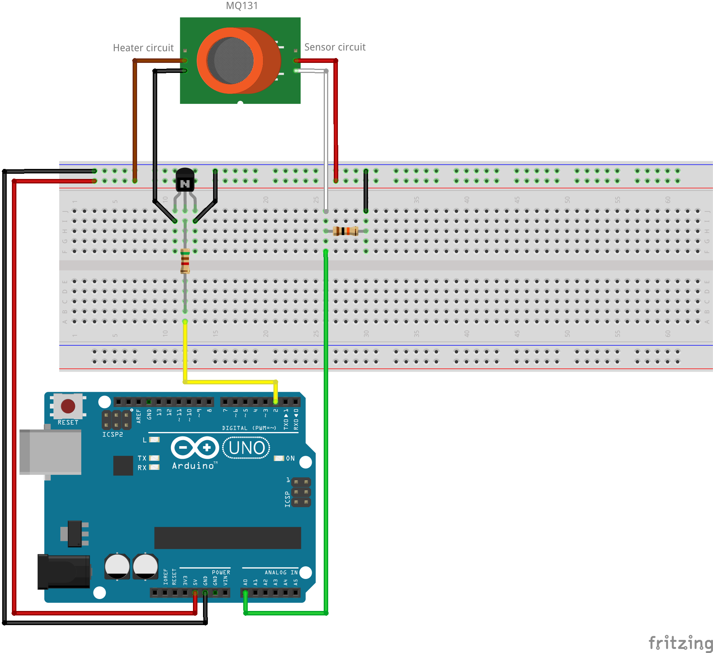
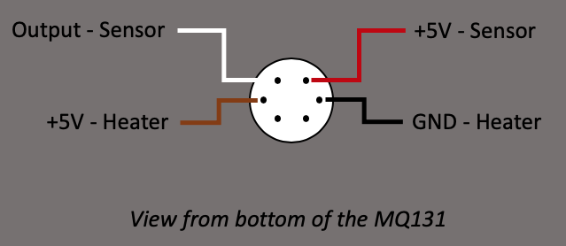
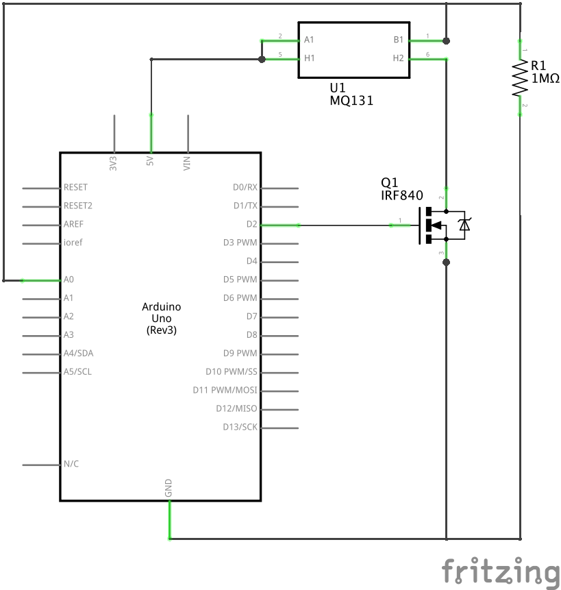

# Arduino-MQ131-driver
Arduino library for ozone gas sensor MQ131

[](https://github.com/ostaquet/Arduino-MQ131-driver/blob/master/LICENSE)
[](#releases)
[](https://github.com/ostaquet/Arduino-MQ131-driver/issues)

 This is a comprehensive Arduino library to obtain ozone (O3) concentration in the air with the Winsen MQ131 sensor. The library supports both versions of the sensor (low concentration and high concentration), the calibration, the control of the heater, the environmental adjustments (temperature and humidity) and the output of values in ppm (parts per million), ppb (parts per billion), mg/m3 and µg/m3.

## To know before starting...
 * The MQ131 is a [semiconductor gas sensor](https://en.wikipedia.org/wiki/Gas_detector#Semiconductor) composed by a heater circuit and a sensor circuit.
 * Heater consumes at least 150 mA. So, __don't connect it directly on a pin of the Arduino__.
 * It is important to respect the pinout of the sensor. If you put Vcc on the sensor and not on the heater, __you could damage your sensor irreversibly.__ 
 * Sensor MQ131 requires minimum 48h preheat time before giving consistent results (also called "burn-in" time)
 * There are three different MQ131: 
   * a black bakelite sensor for low concentration of ozone (with WO3 sensitive material)
   * a blue bakelite sensor for low concentration of ozone (with SnO2 sensitive material)
   * a metal sensor for high concentration of ozone.
 * This driver is made to control the "naked" [Winsen](https://www.winsen-sensor.com) MQ131. The driver is able to pilot the [low concentration WO3 version](https://github.com/ostaquet/Arduino-MQ131-driver/blob/master/extras/datasheet/MQ131-low-concentration.pdf), the [low concentration Sn02 version](https://github.com/ostaquet/Arduino-MQ131-driver/blob/master/extras/datasheet/MQ131-low-concentration-SnO2.pdf) and the [high concentration version](https://github.com/ostaquet/Arduino-MQ131-driver/blob/master/extras/datasheet/MQ131-high-concentration.pdf).
 * To measure the air quality (e.g. pollution), it's better to use the low concentration MQ131 because the high concentration is not accurate enough for low concentration.
 
## How to install the library?
The easiest way to install the library is to go to the Library manager of the Arduino IDE and install the library.
 1. In the Arduino IDE, go into Menu _Tools_ -> _Manage Libraries..._
 2. Search for _MQ131_
 3. Install _MQ131 gas sensor by Olivier Staquet_
 
## Circuit
 * Heater is controlled by MOSFET N-channel via the control pin (on schema pin 2, yellow connector)
 * Result of the sensor is read through analog with RL of 1MΩ (on schema pin A0, green connector)
 
Remarks:
 * The MOSFET is a IRF840 but any N-channel MOSFET that can be controlled by 5V is OK.
 * The load resistance (RL) can be different than 1MΩ (tested also with 10kΩ) but don't forget to calibrate the R0 and time to heat.







## Basic program to use your MQ131
```
#include "MQ131.h"

void setup() {
  Serial.begin(115200);

  // Init the sensor
  // - Heater control on pin 2
  // - Sensor analog read on pin A0
  // - Model LOW_CONCENTRATION
  // - Load resistance RL of 1MOhms (1000000 Ohms)
  MQ131.begin(2,A0, LOW_CONCENTRATION, 1000000);  

  Serial.println("Calibration in progress...");
  
  MQ131.calibrate();
  
  Serial.println("Calibration done!");
  Serial.print("R0 = ");
  Serial.print(MQ131.getR0());
  Serial.println(" Ohms");
  Serial.print("Time to heat = ");
  Serial.print(MQ131.getTimeToRead());
  Serial.println(" s");
}

void loop() {
  Serial.println("Sampling...");
  MQ131.sample();
  Serial.print("Concentration O3 : ");
  Serial.print(MQ131.getO3(PPM));
  Serial.println(" ppm");
  Serial.print("Concentration O3 : ");
  Serial.print(MQ131.getO3(PPB));
  Serial.println(" ppb");
  Serial.print("Concentration O3 : ");
  Serial.print(MQ131.getO3(MG_M3));
  Serial.println(" mg/m3");
  Serial.print("Concentration O3 : ");
  Serial.print(MQ131.getO3(UG_M3));
  Serial.println(" ug/m3");

  delay(60000);
}
```

The result gives us:
```
Calibration in progress...
Calibration done!
R0 = 1917.22 Ohms
Time to heat = 80 s
Sampling...
Concentration O3 : 0.01 ppm
Concentration O3 : 7.95 ppb
Concentration O3 : 0.02 mg/m3
Concentration O3 : 16.80 ug/m3
```

## Usage
The driver has to be initialized with 4 parameters:
 * Pin to control the heater power (example: 2)
 * Pin to measure the analog output (example: A0)
 * Model of sensor `LOW_CONCENTRATION`, `SN_O2_LOW_CONCENTRATION` or `HIGH_CONCENTRATION` (example: `LOW_CONCENTRATION`)
 * Value of load resistance in Ohms (example: 1000000 Ohms)
```
MQ131.begin(2,A0, LOW_CONCENTRATION, 1000000);
```

Before using the driver, it's better to calibrate it. You can do that through the function `calibrate()`. The best is to calibrate the sensor at 20°C and 65% of humidity in clean fresh air. If you need some log on the console, mention the serial in the function `begin()` (example by using the standard Serial: `MQ131.begin(2,A0, LOW_CONCENTRATION, 1000000, (Stream *)&Serial);`).

The calibration adjusts 2 parameters:
 * The value of the base resistance (R0)
 * The time required to heat the sensor and get consistent readings (Time to read)
```
MQ131.calibrate();
```

Those calibration values are used for the usage of the sensor as long as the Arduino is not restarted. Nevertheless, you can get the values for your sensor through the getters:
```
MQ131.getR0();
MQ131.getTimeToRead();
```

And set up the values in the initialization of your program through the setters:
```
MQ131.setR0(value);
MQ131.setTimeToRead(value);
```

In order to get the values from the sensor, you just start the process with the `sample()` function. **Please notice that the function locks the flow.** If you want to do additional processing during the heating/reading process, you should extend the class. The methods are protected and the driver can be extended easily.
```
MQ131.sample();
```

The reading of the values is done through the `getO3()` function. Based on the parameter, you can ask to receive the result in ppm (`PPM`), ppb (`PPB`), mg/m3 (`MG_M3`) or µg/m3 (`UG_M3`).
```
MQ131.getO3(PPM);
MQ131.getO3(PPB);
MQ131.getO3(MG_M3);
MQ131.getO3(UG_M3);
```

The sensor is sensible to environmental variation (temperature and humidity). If you want to have correct values, you should set the temperature and the humidity before the call to `getO3()` function with the function `setEnv()`. Temperature are in °C and humidity in %. The values should come from another sensor like the DHT22.
```
MQ131.setEnv(23, 70);
```


## Links
 * [Calculation of sensitivity curves](https://github.com/ostaquet/Arduino-MQ131-driver/blob/master/extras/datasheet/Sensitivity_curves.xlsx)
 * [Datasheet MQ131 low concentration WO3 (black bakelite version)](https://github.com/ostaquet/Arduino-MQ131-driver/blob/master/extras/datasheet/MQ131-low-concentration.pdf)
 * [Datasheet MQ131 low concentration SnO2 (blue bakelite version)](https://github.com/ostaquet/Arduino-MQ131-driver/blob/master/extras/datasheet/MQ131-low-concentration-SnO2.pdf)
 * [Datasheet MQ131 high concentration (metal version)](https://github.com/ostaquet/Arduino-MQ131-driver/blob/master/extras/datasheet/MQ131-high-concentration.pdf)
