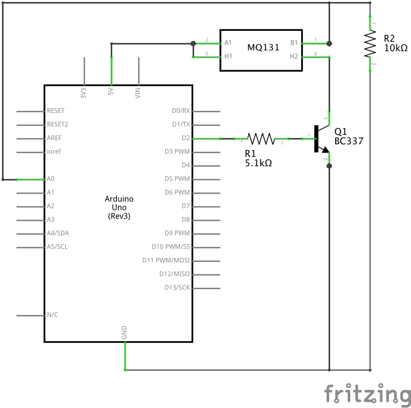

# Arduino-MQ131-driver
Arduino driver for gas sensor MQ131 (O3, NOx and CL2)

## To know before started...
 * The MQ131 is a [electrochemical gas sensor](https://en.wikipedia.org/wiki/Electrochemical_gas_sensor) composed by a heater circuit and a sensor circuit.
 * Heater consumes minimum 150mA. So, __don't connect it directly on a pin of the Arduino__.
 * Sensor MQ131 requires minimum 48h pre-heat time before giving consistent results (also called "burn-in" time)
 * There are 3 different datasheets for the MQ131 for 3 different types of sensor (see links)
 * This driver is made to control a "naked" MQ131 for the [bakelite black MQ131](https://github.com/ostaquet/Arduino-MQ131-driver/blob/master/datasheet/MQ131-black.pdf) and the [metal MQ131](https://github.com/ostaquet/Arduino-MQ131-driver/blob/master/datasheet/MQ131-metal.pdf).
 * This driver __is not tested__ with the [bakelite blue MQ131 (6V heater)](https://github.com/ostaquet/Arduino-MQ131-driver/blob/master/datasheet/MQ131-blue.pdf).
 
## Circuit
 * Heater is controlled by NPN transistor via the control pin (on schema PIN 2, yellow connector)
 * Result of sensor is read through analog with RL of 10kΩ (on schema pin A0, green connector)
 

## Links
 * [Calculation of sensitivity curves](https://github.com/ostaquet/Arduino-MQ131-driver/blob/master/datasheet/Sensitivity_curves.xlsx)
 * [Datasheet MQ131 (black bakelite version)](https://github.com/ostaquet/Arduino-MQ131-driver/blob/master/datasheet/MQ131-black.pdf)
 * [Datasheet MQ131 (metal version)](https://github.com/ostaquet/Arduino-MQ131-driver/blob/master/datasheet/MQ131-metal.pdf)
 * [Datasheet MQ131 (blue bakelite / 6V version)](https://github.com/ostaquet/Arduino-MQ131-driver/blob/master/datasheet/MQ131-blue.pdf)
